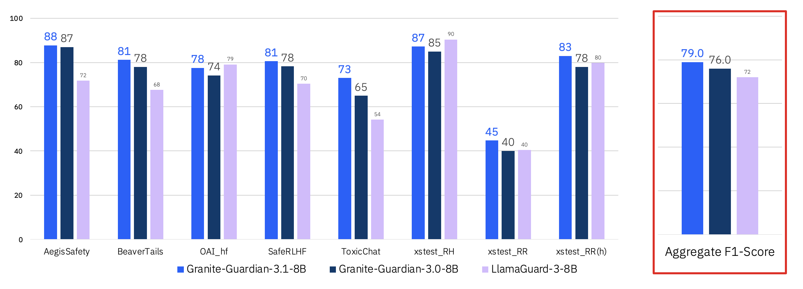
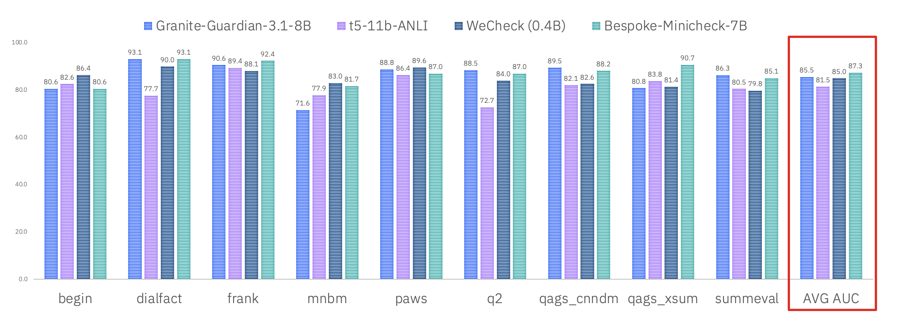

# Granite Guardian

👉 (Dec-2024) Granite-Guardian-3.1 has landed! Updated notebooks, documentation, and results!

👉 (Dec-2024) Added :books: <a href="https://github.com/ibm-granite/granite-guardian/blob/main/technical_report.pdf">**technical report**</a> for Granite-Guardian-3.0

## Overview

The Granite Guardian models are a collection of models designed to detect risks in prompts and responses.
Trained on instruction fine-tuned Granite languages models, these models can help with risk detection along many key dimensions catalogued in the [IBM AI Risk Atlas](https://www.ibm.com/docs/en/watsonx/saas?topic=ai-risk-atlas).
These models are trained on unique data comprising human annotations from socioeconomically diverse people and synthetic data informed by internal red-teaming. 
They outperform similar models on standard benchmarks.

## Quick Links

- :books: <a href="https://github.com/ibm-granite/granite-guardian/blob/main/technical_report.pdf">**Technical Report**</a>

- **Granite Guardian Collection:**
  - 🤗 [Granite-Guardian-3.1-8B](https://huggingface.co/ibm-granite/granite-guardian-3.1-8b)
  - 🤗 [Granite-Guardian-3.1-2B](https://huggingface.co/ibm-granite/granite-guardian-3.1-2b)
  - 🤗 [Granite-Guardian-HAP-125M](https://huggingface.co/ibm-granite/granite-guardian-hap-125m)
  - 🤗 [Granite-Guardian-HAP-38M](https://huggingface.co/ibm-granite/granite-guardian-hap-38m)
- **Granite Guardian Recipes:**
  - 📕 [Quick Start Guide](https://github.com/ibm-granite/granite-guardian/tree/main/cookbooks/granite-guardian-3.1/quick_start_vllm.ipynb) provides steps to start using Granite Guardian for detecting risks in prompts (user message), responses (assistant message), RAG use cases, or agentic workflows.
  - 📕 [Detailed Guide](https://github.com/ibm-granite/granite-guardian/tree/main/cookbooks/granite-guardian-3.1/detailed_guide_vllm.ipynb) explores different risk dimensions in depth and shows how to assess custom risk definitions with Granite Guardian.
  - 📕 [Usage Governance Workflow](https://github.com/ibm-granite/granite-guardian/tree/main/cookbooks/granite-guardian-3.1/usage_governance_workflow_vllm.ipynb) outlines steps for users investigating AI risks within a use-case, incentivizing them to explore risks from the IBM AI Risk Atlas using Granite Guardian.
  - 📕 [Hate, Abuse, and Profanity (HAP) Detection](https://github.com/ibm-granite-community/granite-snack-cookbook/blob/main/recipes/Granite_Guardian/HAP.ipynb)
- **Demos:**
  - 🤗 [HF Spaces Demo](https://huggingface.co/spaces/ibm-granite/granite-guardian)
  - ▶️ [Walkthrough with GG-3.0](https://ibm.biz/gg_demo) 
- **Additional Resources:**
  - **Paper:** [Granite Guardian](https://arxiv.org/abs/2412.07724)
  - 🤗 Datasets - [SocialStigmaQA](https://huggingface.co/datasets/ibm/SocialStigmaQA), [SocialStigmaQA-JA](https://huggingface.co/datasets/ibm/SocialStigmaQA-JA), [AttaQ](https://huggingface.co/datasets/ibm/AttaQ), [ProvoQ](https://huggingface.co/datasets/ibm/ProvoQ), [WikiContradict](https://huggingface.co/datasets/ibm/Wikipedia_contradict_benchmark)
- **Website**: [Granite Guardian Docs](https://www.ibm.com/granite/docs/models/guardian/)
- **License:** [Apache 2.0](https://www.apache.org/licenses/LICENSE-2.0)


## Usage
### Intended use

Granite Guardian is useful for risk detection use-cases which are applicable across a wide-range of enterprise applications -  
- Detecting harm-related risks within prompt text or model response (as guardrails). These present two fundamentally different use cases as the former assesses user supplied text while the latter evaluates model generated text.
- RAG (retrieval-augmented generation) use-case where the guardian model assesses three key issues: context relevance (whether the retrieved context is relevant to the query), groundedness (whether the response is accurate and faithful to the provided context), and answer relevance (whether the response directly addresses the user's query).
- Function calling risk detection within agentic workflows, where Granite Guardian evaluates intermediate steps for syntactic and semantic hallucinations. This includes assessing the validity of function calls and detecting fabricated information, particularly during query translation.
 
### Scope of Use

- Granite Guardian models must <ins>only</ins> be used strictly for the prescribed scoring mode, which generates yes/no outputs based on the specified template. Any deviation from this intended use may lead to unexpected, potentially unsafe, or harmful outputs. The model may also be prone to such behaviour via adversarial attacks. 
- The model is targeted for risk definitions of general harm, social bias, profanity, violence, sexual content, unethical behavior, jailbreaking, or groundedness/relevance for retrieval-augmented generation, and function calling hallucinations for agentic workflows.
It is also applicable for use with custom risk definitions, but these require testing.
- The model is only trained and tested on English data.
- Given their parameter size, the main Granite Guardian models are intended for use cases that require moderate cost, latency, and throughput such as model risk assessment, model observability and monitoring, and spot-checking inputs and outputs.
Smaller models, like the [Granite-Guardian-HAP-38M](https://huggingface.co/ibm-granite/granite-guardian-hap-38m) for recognizing hate, abuse and profanity can be used for guardrailing with stricter cost, latency, or throughput requirements.

## Evaluations

### Harm Benchmarks
Following the general harm definition, Granite-Guardian-3.1-2B is evaluated across the standard benchmarks of [Aeigis AI Content Safety Dataset](https://huggingface.co/datasets/nvidia/Aegis-AI-Content-Safety-Dataset-1.0), [ToxicChat](https://huggingface.co/datasets/lmsys/toxic-chat), [HarmBench](https://github.com/centerforaisafety/HarmBench/tree/main), [SimpleSafetyTests](https://huggingface.co/datasets/Bertievidgen/SimpleSafetyTests), [BeaverTails](https://huggingface.co/datasets/PKU-Alignment/BeaverTails), [OpenAI Moderation data](https://github.com/openai/moderation-api-release/tree/main), [SafeRLHF](https://huggingface.co/datasets/PKU-Alignment/PKU-SafeRLHF) and [xstest-response](https://huggingface.co/datasets/allenai/xstest-response). With the risk definition set to `jailbreak`, the model gives a recall of 0.90 for the jailbreak prompts within ToxicChat dataset.

Following plot compares F1 scores for different models across the benchmark datasets.


 
### RAG Hallucination Benchmarks 
For risks in RAG use cases, the model is evaluated on [TRUE](https://github.com/google-research/true) benchmarks.



### Function Calling Hallucination Benchmarks 
The model performance is evaluated on the DeepSeek generated samples from [APIGen](https://huggingface.co/datasets/Salesforce/xlam-function-calling-60k) dataset, the [ToolAce](https://huggingface.co/datasets/Team-ACE/ToolACE) dataset, and different splits of the [BFCL v2](https://gorilla.cs.berkeley.edu/blogs/12_bfcl_v2_live.html) datasets. For DeepSeek and ToolAce dataset, synthetic errors are generated from `mistralai/Mixtral-8x22B-v0.1` teacher model. For the others, the errors are generated from existing function calling models on corresponding categories of the BFCL v2 dataset.


## Training Data
Granite Guardian 3.1 models are trained on a combination of human annotated and synthetic data. Samples from [hh-rlhf](https://huggingface.co/datasets/Anthropic/hh-rlhf) dataset were used to obtain responses from Granite and Mixtral models.
These prompt-response pairs were annotated for different risk dimensions by a group of people at DataForce.
DataForce prioritizes the well-being of its data contributors by ensuring they are paid fairly and receive livable wages for all projects.
Additional synthetic data was used to supplement the training set to improve performance for hallucination and jailbreak related risks.

### Annotator Demographics

| Year of Birth      | Age               | Gender | Education Level                                 | Ethnicity                     | Region          |
|--------------------|-------------------|--------|-------------------------------------------------|-------------------------------|-----------------|
| Prefer not to say   | Prefer not to say | Male   | Bachelor                                        | African American               | Florida         |
| 1989               | 35                | Male   | Bachelor                                        | White                         | Nevada          |
| Prefer not to say   | Prefer not to say | Female | Associate's Degree in Medical Assistant         | African American               | Pennsylvania    |
| 1992               | 32                | Male   | Bachelor                                        | African American               | Florida         |
| 1978               | 46                | Male   | Bachelor                                        | White                         | Colorado        |
| 1999               | 25                | Male   | High School Diploma                             | Latin American or Hispanic     | Florida         |
| Prefer not to say   | Prefer not to say | Male   | Bachelor                                        | White                         | Texas           |
| 1988               | 36                | Female | Bachelor                                        | White                         | Florida         |
| 1985               | 39                | Female | Bachelor                                        | Native American                | Colorado / Utah |
| Prefer not to say   | Prefer not to say | Female | Bachelor                                        | White                         | Arkansas        |
| Prefer not to say   | Prefer not to say | Female | Master of Science                               | White                         | Texas           |
| 2000               | 24                | Female | Bachelor of Business Entrepreneurship           | White                         | Florida         |
| 1987               | 37                | Male   | Associate of Arts and Sciences - AAS            | White                         | Florida         |
| 1995               | 29                | Female | Master of Epidemiology                          | African American               | Louisiana       |
| 1993               | 31                | Female | Master of Public Health                         | Latin American or Hispanic     | Texas           |
| 1969               | 55                | Female | Bachelor                                        | Latin American or Hispanic     | Florida         |
| 1993               | 31                | Female | Bachelor of Business Administration             | White                         | Florida         |
| 1985               | 39                | Female | Master of Music                                 | White                         | California      |


### Citation
```latex
@misc{padhi2024graniteguardian,
      title={Granite Guardian}, 
      author={Inkit Padhi and Manish Nagireddy and Giandomenico Cornacchia and Subhajit Chaudhury and Tejaswini Pedapati and Pierre Dognin and Keerthiram Murugesan and Erik Miehling and Martín Santillán Cooper and Kieran Fraser and Giulio Zizzo and Muhammad Zaid Hameed and Mark Purcell and Michael Desmond and Qian Pan and Zahra Ashktorab and Inge Vejsbjerg and Elizabeth M. Daly and Michael Hind and Werner Geyer and Ambrish Rawat and Kush R. Varshney and Prasanna Sattigeri},
      year={2024},
      eprint={2412.07724},
      archivePrefix={arXiv},
      primaryClass={cs.CL},
      url={https://arxiv.org/abs/2412.07724}, 
}
```
